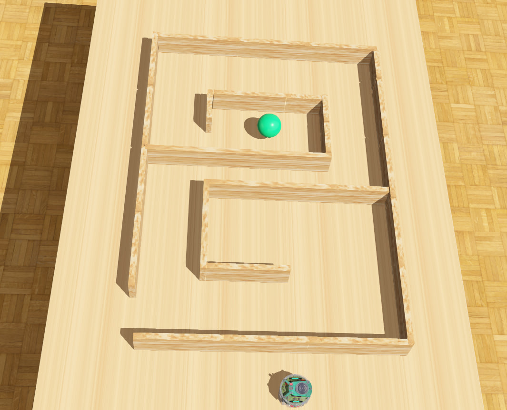
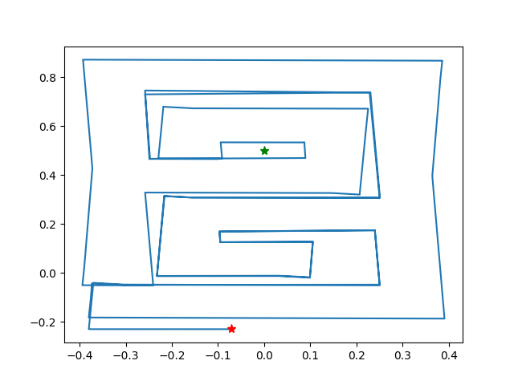
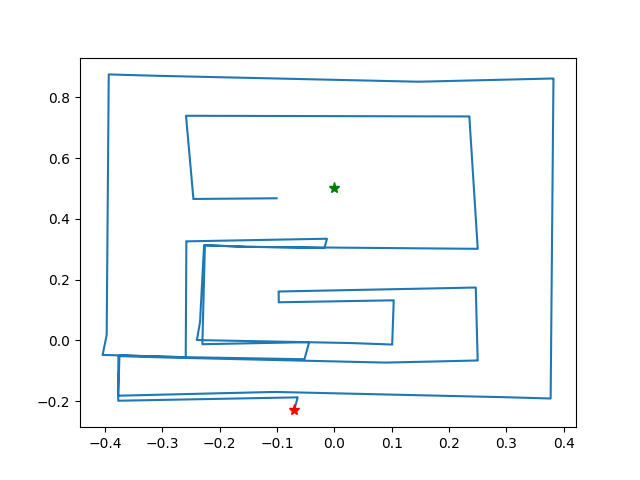
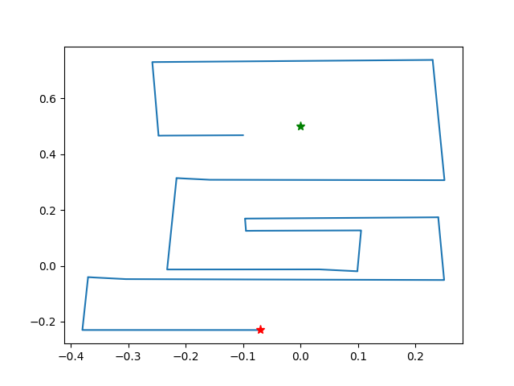

# Bug Algorithms in Maze #
*Using Bug 1 and 2 (and also Wall-Following) algorithms for routing through a maze and reaching the goal (the ball)*

**The Maze**

**Path taken by Bug 1**

**Path taken by Bug 2**

**Path taken by Wall-Following**

